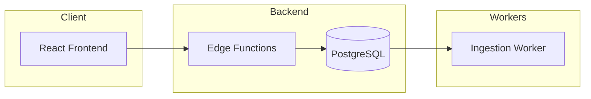
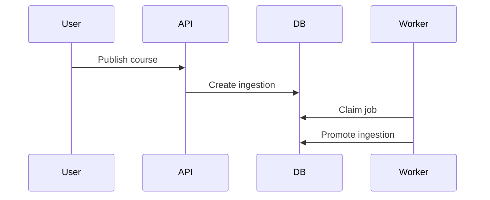
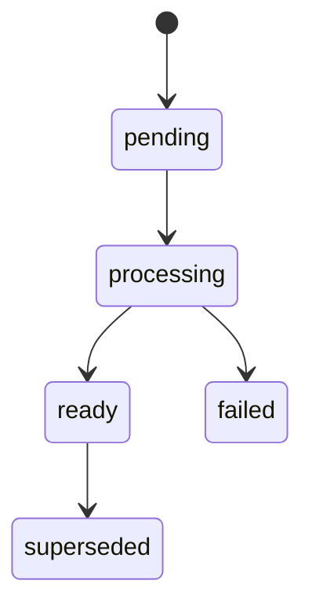
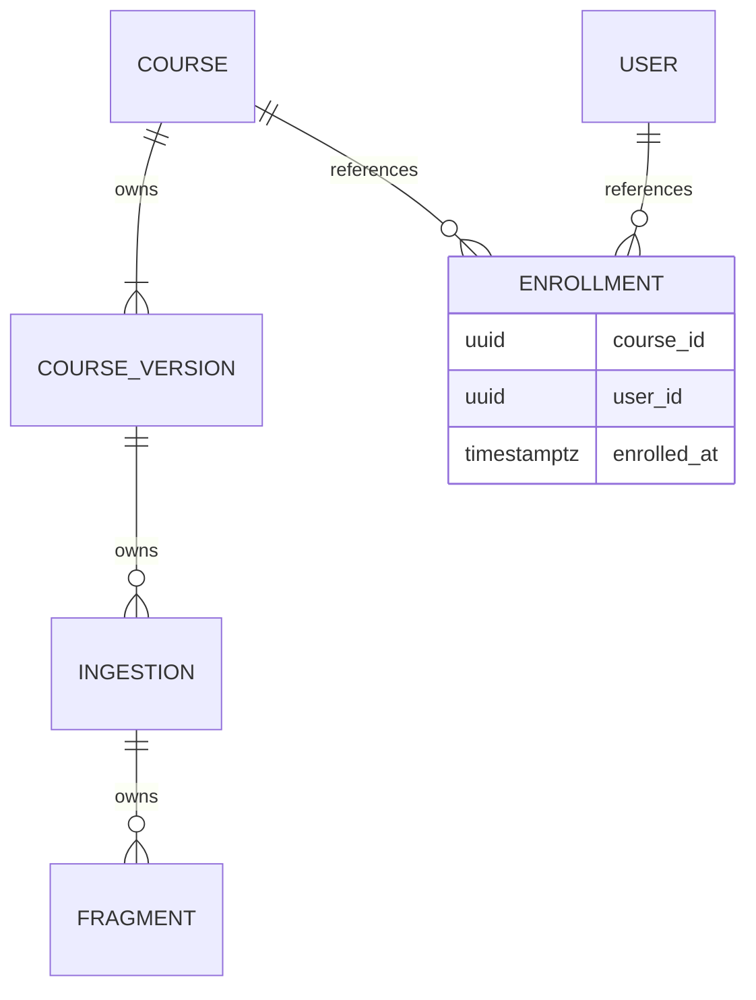

# Diagram Codebase — Reference

Load when drawing (Process step 8), when step 6 hits weak entities / roles / anomalies, or before shipping (self-check).

## Mermaid ER cardinality

| Syntax        | Meaning                 |
| ------------- | ----------------------- |
| `\|\|`        | exactly one (mandatory) |
| `o\|` / `\|o` | zero or one (optional)  |
| `\|{` / `}\|` | one or more             |
| `o{` / `}o`   | zero or more            |

Exact crow's-foot forms to emit:

| Form         | Meaning                                              |
| ------------ | ---------------------------------------------------- |
| `\|\|--\|\|` | 1:1, both mandatory                                  |
| `\|\|--o\|`  | 1:1, right optional                                  |
| `\|\|--o{`   | 1:N, child optional                                  |
| `\|\|--\|{`  | 1:N, child mandatory (≥1)                            |
| `}o--o{`     | N:M only when no junction table exists in the schema |

Evidence → syntax:

- FK `NOT NULL` → mandatory near-side (`|`)
- FK nullable → optional (`o`)
- `UNIQUE` on FK column(s) → 1:1, not 1:N
- No UNIQUE → 1:N (or N:M via junction entity)

## Diagram templates

**1. System architecture — boundaries first**

**2. Primary workflow**

**3. Lifecycle of the central entity**

**4. Data relationships** — cardinality proven, junction visible, ownership in the label

## When the schema has these patterns (step 6 toggle)

### Weak entities

A schwacher Entitätstyp is existence-dependent and identified only through its parent — composite PK = parent's key + discriminator. Mermaid has no dedicated notation: annotate the edge label `identifying`, and never draw the weak entity without its parent.

### Roles, recursion, multiple relationships

Two FKs between the same pair are distinct roles (`ships_to`, `bills_to`), not one relationship drawn twice. Every edge label is the role name — never generic `has`. Self-referencing FKs get an explicit self-edge with that role.

### Anomaly risk lint (OLTP only)

After harvesting, flag cheap 1NF/2NF/3NF risks beside the diagram as **Anomaly risk** (Einfüge- / Lösch- / Änderungsanomalie):

- array or JSON columns holding multi-valued attributes (1NF)
- non-key attributes depending on part of a composite key (2NF)
- transitive dependencies between non-key attributes (3NF)

**Exempt** star / snowflake / other OLAP-shaped schemas — deliberate denormalization is not noise to flag.

## Self-check before shipping

- [ ] Entry points were read, not inferred
- [ ] The tracer bullet path contains no gaps
- [ ] All four diagrams parse
- [ ] Every node maps to a file in the evidence table
- [ ] No orphan nodes; no arrows without a caller
- [ ] Each ER edge uses proven cardinality (not default `||--o{`)
- [ ] Junction / association tables are entities, not collapsed `}o--o{`
- [ ] No derived A→C when A→B→C already exists
- [ ] Assumptions live in the Unverified list, not in the diagrams
- [ ] Nothing in the scanned folder was modified
